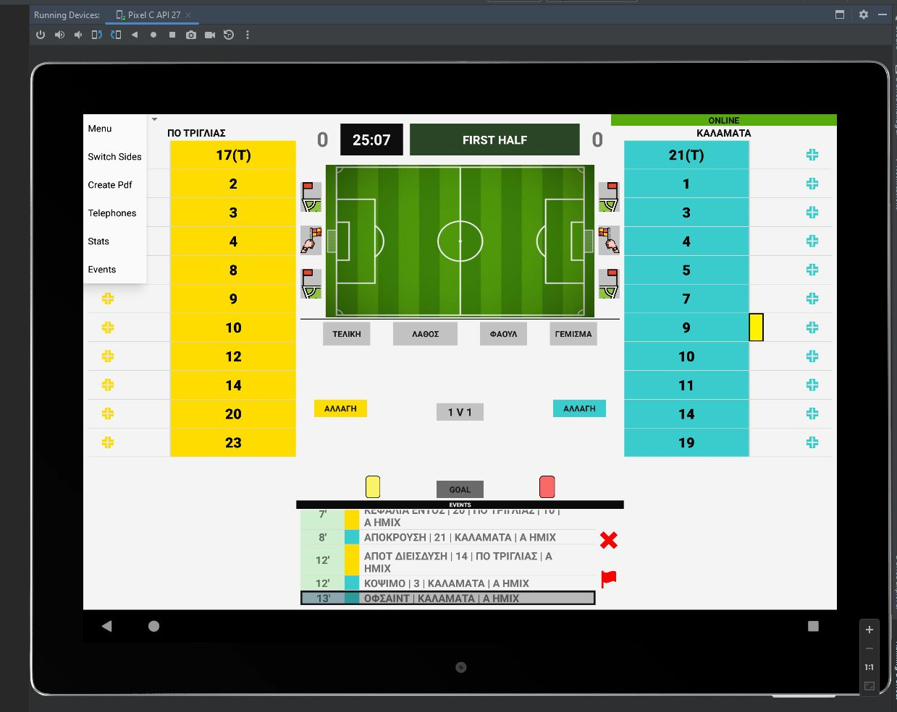

# New Generation Stats

## Description
**New Generation Stats** is an Android application designed for real-time football sports data entry. The app allows users to efficiently input and manage live game statistics, enhancing the experience for sports analysts and fans alike.

## Features
- **Real-time data entry** for football matches
- **User-friendly interface** optimized for tablet devices
- **Efficient performance** using RESTful services for backend integration
- **Offline capabilities** through local SQLite storage

## Technologies Used
- **Programming Languages:** Java
- **Frameworks & Libraries:**
  - Android SDK
  - Retrofit library for API integration
  - Gson for JSON serialization/deserialization
  - DroidNet for network connectivity management
  - iText PDF library for PDF creation and manipulation
  - Android PDF Viewer for displaying PDF files

- **Layout and Design:**
  - AppCompat for backward compatibility
  - Constraint Layout for flexible UI design

- **Testing:**
  - JUnit for unit testing
  - Espresso for UI testing

- **Database:**
  - SQLite for local data storage

- **Additional Libraries:**
  - OkHttp for HTTP requests and logging

## Running the App
- **Recommended Device:** Use an Android tablet with Android 13 for optimal performance, as the app includes a PDF creator library.
- **Installation:** To run the app, simply install it on your Android tablet.

## Screenshots

  
  
  
  
  
  

  
  
  
  
  
  

## Coordinator and Acknowledgments
- **Ioannis Vasileiou** (Lead Developer and Coordinator)  
- **Spyros Mantelos** (Assistant Coordinator)

## Additional Information
This project has two versions:
1. One utilizing **RESTful services** and
2. another connected to **Firebase**. 

This README focuses on the version with RESTful services.
